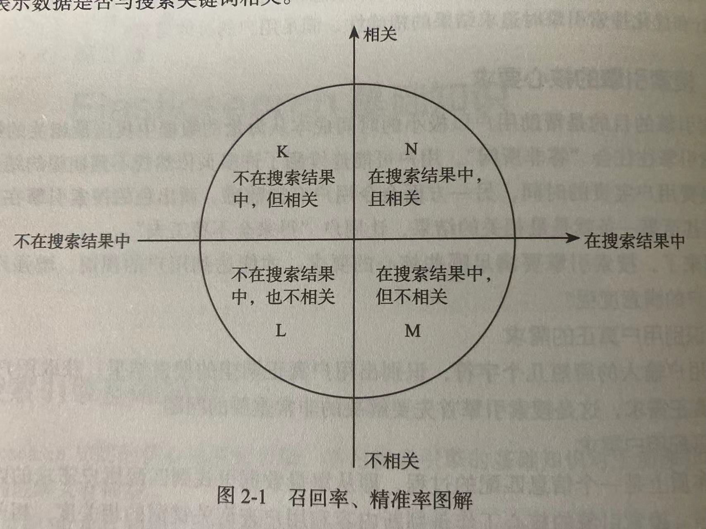

# 2.1 搜索引擎基础知识

## 2.1.3 检索质量的评价指标

- `召回率 = N / (N + K)`: 在一次返回的搜索结果中,与搜索关键词相关的文档占所有文档的比例
- `精确率 = N / (N + M)`: 本次搜索结果中,相关文档所占比例

## 2.1.4 倒排索引

类似于书中最后的索引,记录关键词及其所在的页码.

倒排索引由2部分组成:

- 单词词典: 每个文档在分词后的词项去重后组成的集合
- 倒排文件: 倒排列表持久化存储的结果

