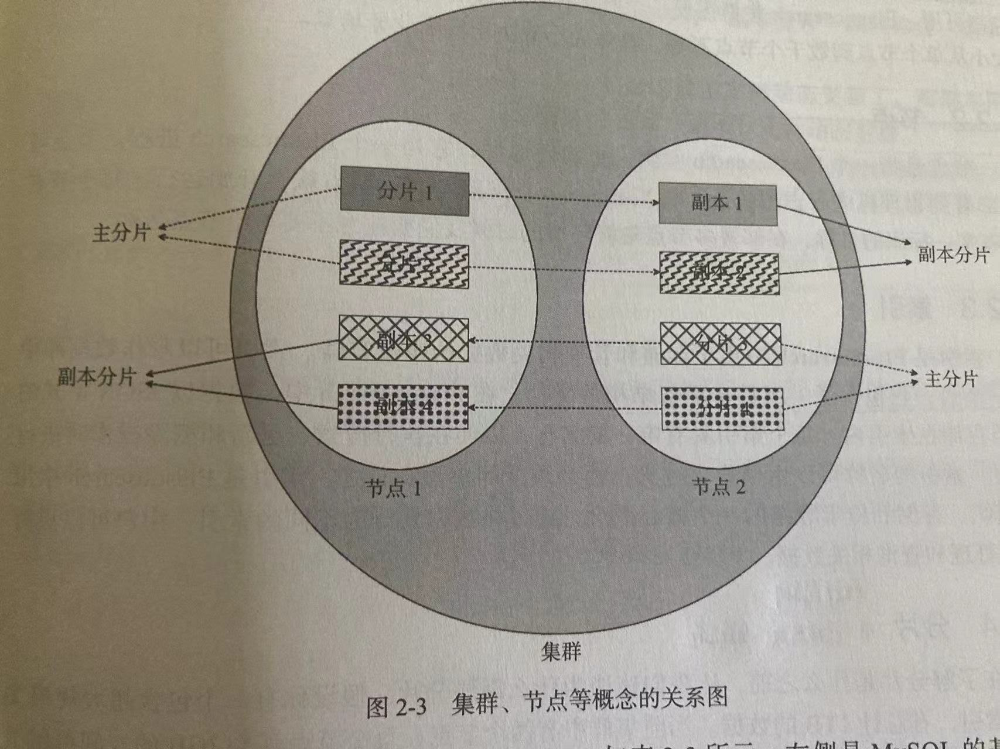

# 2.2 ES核心概念

## 2.2.3 索引

可以认为索引是MySQL中的表,包含了一组具有相似结构的文档.

但ES中,索引是负责存储和读取文档的,不负责定义文档的结构和文档中的字段上的行为

## 2.2.4 分片

分片通过将索引分成更小的部分,来存储索引.可以理解为将一张大表(垂直方向的大)分成几个独立的部分.

分片包含索引数据的一个子集,且分片本身有完整的功能和独立性.

涉及多个分片的查询时,ES将查询请求分发到各个相关的分片,然后将结果集进行聚合

## 2.2.5 副本

创建索引时,需指定主分片,且主分片数量一经指定,无法动态更新.副本也需要在创建索引时指定.

当某个主分片所在的数据节点不可用时,会导致主分片丢失,若短时间内不采取补救措施,则集群会将该分片对应的副本提升为新的主分片

## 2.2.6 文档

文档类似于MySQL中的一行数据.在ES中,文档是存储在索引中的一个JSON对象

## 2.2.7 字段

类似于MySQL中Column的概念.但是ES中的字段可以设定2种或以上的类型

## 2.2.8 映射

类似于MySQL中的Schema.在ES中,映射用于定义索引中每个字段的类型及其行为.

映射用于定义索引的字段类型和字段行为,而索引用于实际存储数据

## 2.2.9 分词

英文按空格分词,中文有结巴分词器